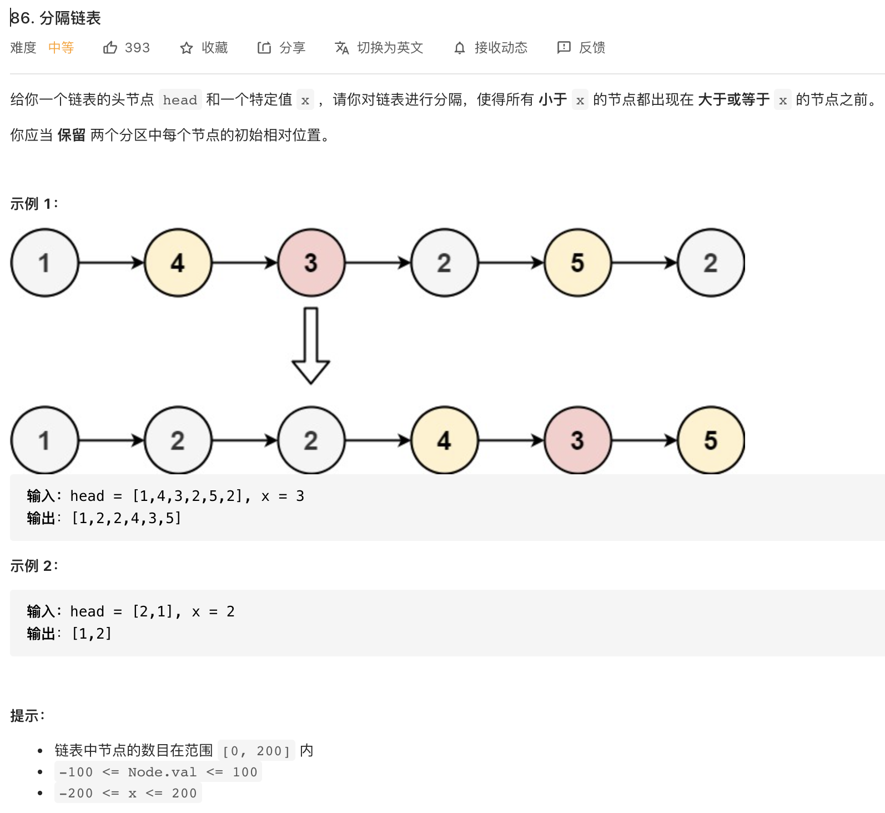

# [86. 分隔链表](https://leetcode-cn.com/problems/partition-list/)

## 题目



```python
class Solution:
    def partition(self, head: ListNode, x: int) -> ListNode:
        # left 和 right是分割后左右链表的指针， left_head用于返回值，right_head是右链表的头结点，用于后面的拼接
        left = left_head= ListNode(0)
        right = right_head = ListNode(0)
        while head:
            if head.val < x:
                left.next = head
                left = left.next
            else:
                right.next =head
                right=right.next
            head = head.next
        right.next = None # 清除野指针
        left.next = right_head.next
        return left_head.next
```