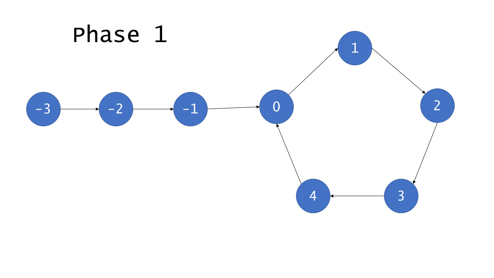

# [142.环形链表 II](https://leetcode-cn.com/problems/linked-list-cycle-ii/)

跟[141.环形链表](https://leetcode-cn.com/problems/linked-list-cycle/)类似，都是用哈希表和快慢指针

## 哈希表法

### 复杂度分析

* 时间复杂度：$O(n)$
* 空间复杂度：$O(n)$

```python
class Solution(object):
    def detectCycle(self, head):
        visited = set() # 注意集合跟字典的区别
        while head is not None:
            if head in visited:
                return head # 能够直接返回结点所在的下标
            else:
                visited.add(head)
                head = head.next
        return None
```


## 基于快慢指针的floyd算法

分为两个阶段

* 阶段一

  跟[141.环形链表](https://leetcode-cn.com/problems/linked-list-cycle/)类似，定义快慢指针遍历链表，如果链表没有环，那么快指针先遍历完此时可以返回```NULL```，如果有环那么一定会相遇，那么分析相遇的点。

  

  环中的节点从 0 到 C-1编号，其中 C是环的长度，非环节点从 -F 到 -1编号，其中 F是环以外节点的数目。 F 次迭代以后，慢指针指向了 0 且快指针指向某个节点 h (此时快指针可能绕过几次环，即$F=h(mod C)$，设此时到第一次相遇的时刻为t，那么有
  $$
  2t=t+C-h
  $$
  即$t=C-h$，慢指针走过的环中距离为$C-h$，也就是说第一次相遇时慢指针走了不到一圈，而快指针走了最少一圈。

  * 阶段二

    

  

  ​	如上，相遇时慢指针走过了$F+a$距离(上文提到慢指针在第一次相遇时不会走到一圈)，而快指针则走过了$F+k(a+b)+a，k=1,2,3...$，此时有：
  $$
  2(F+a)=F+k(a+b)+a
  $$
  得出$F=b+(k-1)C$，那么为了找到环开始的位置，可以建一个两个指针，一个指向链表的头，一个指向相遇的结点，一直遍历直到两者的值相等，说明到了环开始的位置
  
### 复杂度分析

* 时间复杂度：$O(n)$
* 空间复杂度：$O(1)$

```python
class Solution(object):
    def getIntersect(self, head):
        '''检查链表是否存在环形以及返回相遇的结点
        '''
        slow = head
        fast = head
        while fast  and fast.next :
            slow =slow.next
            fast = fast.next.next
            if slow == fast:
                return slow
        return None

    def detectCycle(self, head):
        if head is None:
            return None
        intersect = self.getIntersect(head)
        if intersect is None:
            return None
        # 阶段二
        ptr1 = head
        ptr2 = intersect
        while ptr1 != ptr2:
            ptr1 = ptr1.next
            ptr2 = ptr2.next
        return ptr1
```

