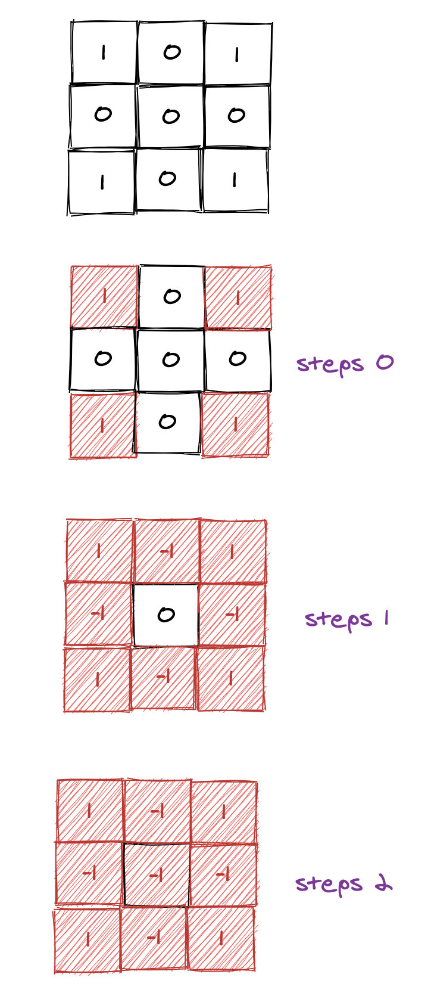

# [1162. As Far from Land as Possible](https://leetcode.com/problems/as-far-from-land-as-possible/)

## BFS

这道题跟[542. 01 Matrix](https://leetcode.com/problems/01-matrix/)类似，我们继续使用上面两道题的套路，即不用visited，而是原地修改。由于这道题求解的是最远的距离，而距离我们可以使用BFS来做。算法：

- 对于每一个海洋，我们都向四周扩展，寻找最近的陆地，每次扩展steps加1。
- 如果找到了陆地，我们返回steps。
- 我们的目标就是所有steps中的最大值。

实际上面算法有很多重复计算，如图中间绿色的区域，向外扩展的时候，如果其周边四个海洋的距离已经计算出来了，那么没必要扩展到陆地。实际上只需要扩展到周边的四个海洋格子就好了，其距离陆地的最近距离就是1 + 周边四个格子中到达陆地的最小距离。

我们考虑优化。

- 将所有陆地加入队列，而不是海洋。
- 陆地不断扩展到海洋，每扩展一次就steps加1，直到无法扩展位置。
- 最终返回steps即可。

图解：

复杂度：时O(n^2)，空O(n^2)