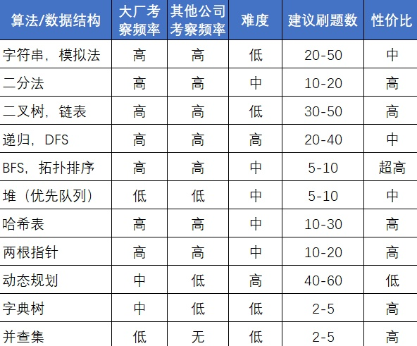

按标签刷题，首先是基本的数据结构比如链表，二叉树等，然后是基础的算法比如二分搜索，动态规划等，然后是一些思想比如递归与迭代等等。

## 基本数据结构
二叉树
链表
栈和队列
二进制
字符串

## 算法

## Ref

[怎么刷leetcode](https://www.zhihu.com/question/280279208)

[LeetCode按照怎样的顺序来刷题比较好？](https://www.zhihu.com/question/36738189/answer/1240179104)
推荐九章算法的回答

[algorithm-pattern](https://greyireland.gitbook.io/algorithm-pattern/)

[如何正确高效地使用LeetCode？](https://www.zhihu.com/question/26580300)

[leetcode笔记](https://mnmunknown.gitbooks.io/algorithm-notes/content/)

